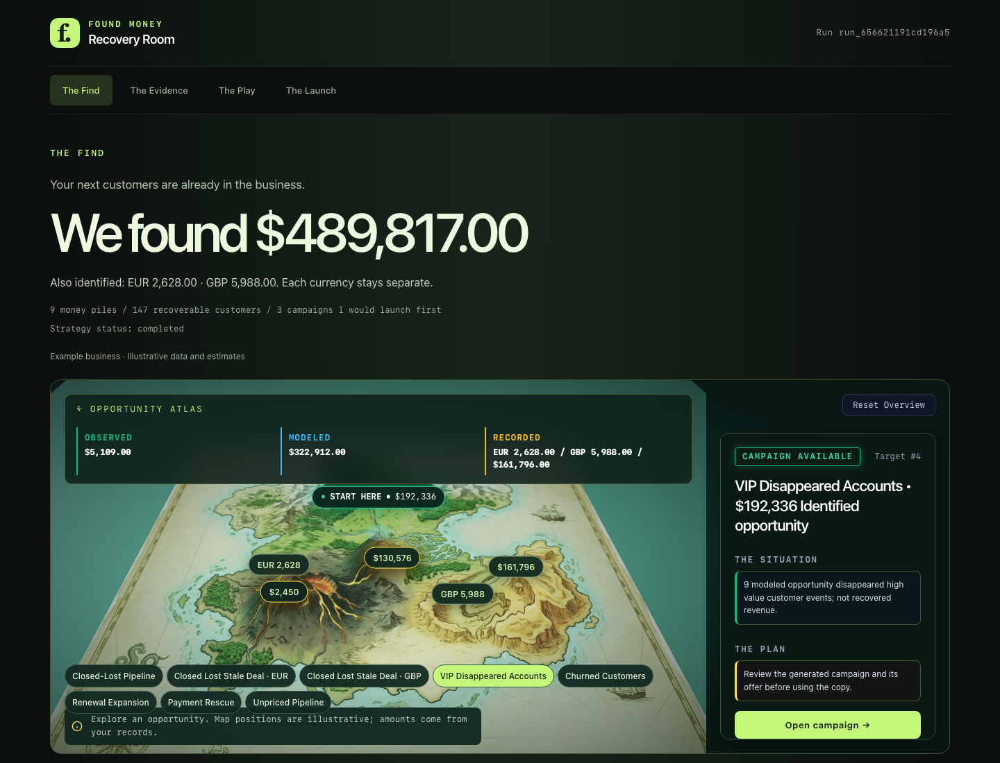

# Found Money Kit

<p>
  
  
  
  
</p>

**The money is already in the business. The dashboard just is not looking at it.**

Found Money reads CRM, billing, order, appointment, proposal, or CSV evidence locally. It groups failed payments, expired trials, closed-lost deals, and lapsed customers into a ranked Money Map, then opens an offline Recovery Room with practical next steps.

It is an operator’s review tool. It does not send messages, write back to business systems, create audiences, or claim that an opportunity has been recovered.

Built for Claude Code, Codex, and any agent that can read skills. Also runs as plain Python with no agent at all.

**Built by Matthew Berman.**

<p align="center">
  
</p>

## the core idea: the Money Map

Most teams celebrate new pipeline and miss the money they already earned.

A card failed. A trial ended. A buyer did not reorder. The CRM still has the person. The billing system still has the invoice. Nobody has a ranked, source-backed map of what is actually recoverable.

I call the missing layer the **Money Map**: one deterministic picture of identified opportunity, by pile, with the value basis written down. Observed when the source supports an amount. Modeled when assumptions size the opportunity. Recorded for source deal values. Unquantified when the evidence is missing. Never a blended "we recovered this" headline.

| What teams usually do | What this kit does |
|---|---|
| Stare at a CRM dashboard | Rank failed payments, expired trials, and lapsed customers from source evidence |
| Treat "we have a list" as a plan | Write a Recovery Play a human can review before anyone is contacted |
| Invent a recovered-revenue number | Keep missing money unquantified and label modeled estimates as estimates |
| Let an agent "just send the dunning email" | Enforce no-send. Approval records do not create a sending path |

That is the framework worth stealing even if you never clone the repo.

## Start here

Requires Python 3.11+ and [uv](https://docs.astral.sh/uv/).

```bash
git clone https://github.com/TheMattBerman/found-money-kit.git
cd found-money-kit
uv sync --frozen --group dev
uv run playwright install chromium
uv run found-money guide --output-root private-runs/example
```

The guided flow uses bundled fixture data for a walkthrough. It asks for the context needed to explain that fixture, builds locally, and opens `private-runs/example/index.html`. For your own exports, use `found-money build` as described below. Review Find, Evidence, Play, then Launch. Launch is an approval checklist for a human, not a send queue.

To install the agent skill for Claude Code or Codex:

```bash
./install.sh claude   # or: ./install.sh codex
bash doctor.sh
```

## Analyze your own exports

```bash
uv run found-money build \
  --config private-runs/inputs/config.json \
  --output-root private-runs/review
```

Prepare the credential-free config and normalized snapshots as described in [the file-mode walkthrough](docs/guides/FILE_MODE_WALKTHROUGH.md). Snapshot paths are relative to the config. A live HubSpot or Stripe read requires explicit authorization, environment credentials, and live-run controls. The kit never selects credentials or enables live mode for you.

## The pipeline

| # | Stage | What it does |
|---|---|---|
| 1 | **SOURCE** | Read-only HubSpot, Stripe, orders, appointments, proposals, or CSV/JSON |
| 2 | **IDENTITY** | Exact-key join. Ambiguity is quarantined, never guessed |
| 3 | **EVENTS** | Recovery event families, plus a deterministic exclusion ledger |
| 4 | **VALUE** | Minor-unit Decimal math. Missing source value stays unquantified |
| 5 | **RANK** | Explainable pile ranking. No silent currency blending |
| 6 | **PLAY** | Grounded Recovery Plays from a frozen, PII-free evidence packet |
| 7 | **ROOM** | Offline four-room Recovery Room, print PDF, Playwright PNG proof |

## What the result means

The Money Map keeps value classes separate:

- **Observed:** a source supplied an amount and currency.
- **Modeled:** an estimate that may use qualifying history and owner-supplied assumptions such as tenure.
- **Recorded:** a source-recorded deal or pipeline value.
- **Unquantified:** the source lacks enough evidence for a defensible amount.

Totals are identified opportunity, not recovered revenue. Identity joins use exact, declared keys; ambiguous records are withheld instead of guessed. Available event families depend on the sources and fields supplied. Private run output belongs in the local, gitignored output tree. Inspect specific output files before sharing; a source-code safety scan does not certify an arbitrary private-run folder. Public projections contain aggregates and tokens only.

## Safety boundary

Found Money is read-only by design. It does not send email or SMS, schedule work, write CRM, billing, advertising, or payment data, create audiences, or persist credentials. Agents may prepare a review and campaign recommendation; a human decides whether to act in the business’s own tools.

See [the operating guide](docs/OPERATING.md) and [the Found Money skill](skills/found-money/SKILL.md).

## more operator kits

Found Money sits in the same family as the rest of the agent kit stack:

- [Frontrun](https://github.com/TheMattBerman/frontrun) - category language before it shows up in the ads
- [Loop Kit](https://github.com/TheMattBerman/loop-kit) - supervised recurring jobs, no send without approval
- [Slideshow Kit](https://github.com/TheMattBerman/slideshow-kit) - daily brand-DNA carousel engine
- [Landing Page Factory](https://github.com/TheMattBerman/landing-page-factory) - URL to a deployable page
- [Creator Breakout Kit](https://github.com/TheMattBerman/creator-breakout-kit) - creator angles before you pay to produce
- [Winning Creative Tracker](https://github.com/TheMattBerman/winning-creative-tracker) - what competitors are actually running

Found Money owns the recovery lane: the money already inside the business, before anyone buys another lead.

## License

MIT. Fork it. No upsell, no catch.

Built by [Matt Berman](https://twitter.com/themattberman).

- Twitter/X: [@themattberman](https://twitter.com/themattberman)
- Newsletter: [Big Players](https://bigplayers.co)
- Agency: [Emerald Digital](https://emerald.digital)

---

Stop hunting for new customers until you have mapped the ones who already tried to pay.
